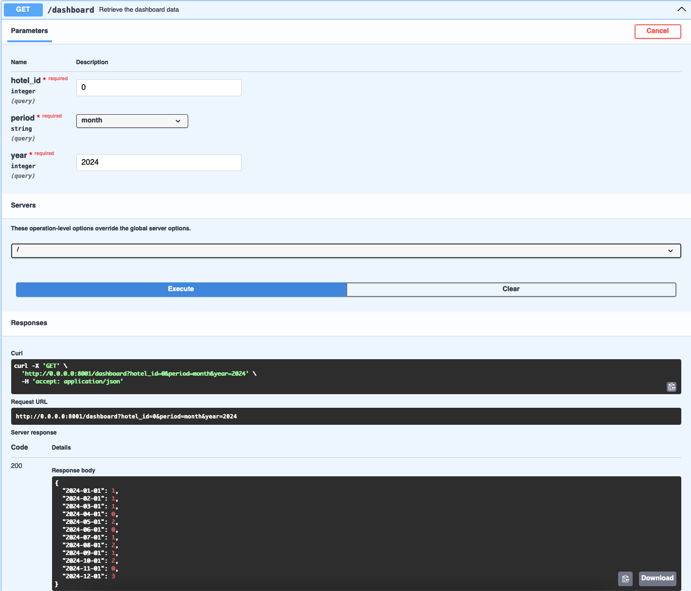

# Booking Event System
This repo contains the code for the `dashboard_service` and the `data_provider`. The system is designed to manage and display bookings for various events and rooms. It provides a comprehensive dashboard for monitoring and managing these bookings.

The services are based on `FastAPI` and use as ORM `sqlalchemy` which is connecting to a `SQLite` DB.

## Running the Services
The services can be started by running the following command:
```sh
bash start_services.sh
```
This runs the docker container of both services and starts their routine.
The dashboard_service will fetch the latest bookings from the data_provder in short intervalls (5 seconds for the purpose of demonstration).

Both services will expose their swagger:
 - dashboard_service: [http://0.0.0.0:8001/docs](http://0.0.0.0:8001/docs)
 - data_provider: [http://0.0.0.0:8000/docs](http://0.0.0.0:8000/docs)

### Inject random booking data
Use the following command to generate random booking data in a 5 second intervall:
```sh
bash send_random_data.sh
```
This will send random booking data for the given year (2024) to the `/events` endpoint of the data_provider to ensure that the service is populated with data.

The `start_date` and `end_date` can be manipulated to generate data for a different time range.


## Data Provider
The `data_provider` module is responsible for handling booking/cancellation events. It handles create and read operations related to bookings. This module ensures data integrity and provides a unified access point for data queries.

### Testing
For running the tests, execute the following commands:
```sh
cd data_provider
bash setup.sh
bash run_test.sh
```

### Key Features
- **Operations**: Supports creating, reading bookings/cancellations.
- **Data Validation**: Ensures that all data meets the system's requirements before being stored.

## Dashboard Service
The `dashboard_service` module provides a rest-api for fetching aggregates of bookings for a hotel. It aggregates data from the `data_provider`.

The data for the daily dashboard will be returned as a json containing as key the `date` and as value the `number of bookings`.
```json
{
  "2024-01-01": 8,
  "2024-01-02": 5,
  "2024-01-03": 4,
  "2024-01-04": 0,
  ...
}
```
The data for the monthly dashboard will be returned as a json containing as key the `date` of the first day of a month (`2024-01-01`) and as value the `number of bookings`.
```json
{
  "2024-01-01": 4,
  "2024-02-01": 4,
  "2024-03-01": 7,
  "2024-04-01": 6,
  "2024-05-01": 10,
  "2024-06-01": 5,
  "2024-07-01": 5,
  "2024-08-01": 5,
  "2024-09-01": 3,
  "2024-10-01": 4,
  "2024-11-01": 2,
  "2024-12-01": 5
}
```

## Inspecting the dashboard data
As example data for fetching the dashboard data use the following:
```json
{
  "hotel_id": 0
  "period": "month" | "day"
  "year": 2024
}
```
Example: [http://0.0.0.0:8001/docs#/default/get_dashboard_dashboard_get](http://0.0.0.0:8001/docs#/default/get_dashboard_dashboard_get)




### Testing
For running the tests, execute the following commands:
```sh
cd dashboard_service
bash setup.sh
bash run_test.sh
```

### Key Features
- **Aggregated Views**: Offers aggregated data views, such as bookings by day or month, to provide insights at a glance.

# Possible Optimizations
 - Use proper logging
 - handle eventual consistency of room booking/cancellation
 - Extend testing
 - Optimize dashboard_service by storing only aggregates (if other data is not needed in the long run)
 - Enforce type checking
 - Evaluate if it makes sense to perform the group by day/month in SQL instead of python for the dashboard_service
 - Add validation for double booking of a room in data_provider
 - Use correct example values in swagger
 - Evaluate if cancellations in dashboard_service result would be interesting